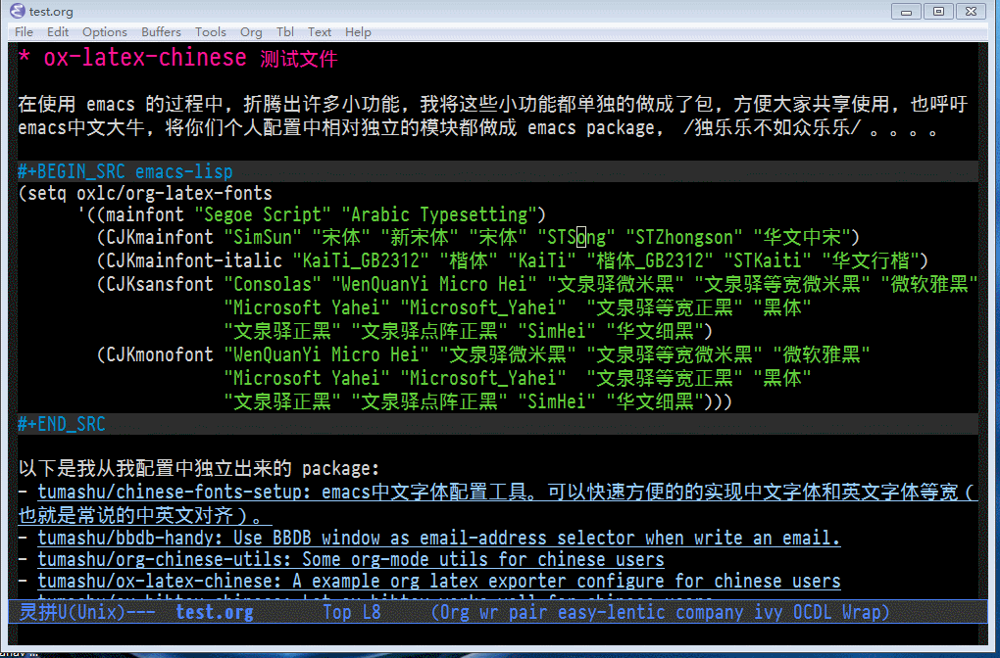
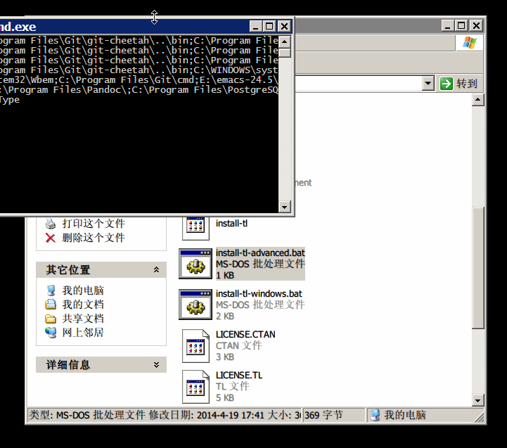
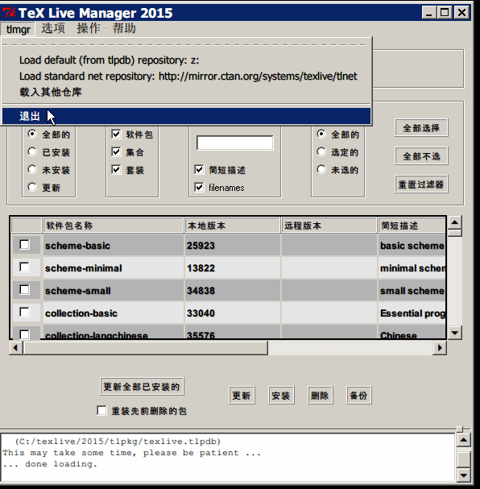

- [README](#org5739f8e)
  - [简介](#org748c678)
  - [下载并安装 Texlive](#org7be969f)
    - [下载 Tex Live ISO 镜像](#org1fae00a)
    - [挂载已经下载的 ISO 镜像](#org434f39b)
    - [运行安装程序](#org85b80d3)
    - [设置安装参数](#org23e6be5)
    - [安装所需要的 Latex 宏包](#orga74848f)
  - [安装 org2ctex](#org4703075)
  - [配置 org2ctex](#org88af0e6)
  - [高级设置](#org04284a2)
    - [如何选择默认 class](#org97f5f1e)
    - [如何添加 Latex 宏包](#org12c9365)
    - [如何导出 org2ctex 的配置](#org43e69a6)
    - [如何禁用自动设置 LaTeX 字体功能](#orgca1f482)
  - [如何设置 LaTeX 片断预览功能](#orgdfea681)
  - [常见错误排查和解决](#org687ff74)
    - [我使用 MSYS2 内置的 Emacs, 无法找到 texlive 相关的命令](#org25e59ec)
    - [转换时字体名字乱码](#orga213bfc)
    - [中文目录下的 org 文件无法转换为 pdf 文件](#org3b7f45e)
    - [缺少必要的 Latex 宏包](#orgbc85e16)

# README

## 简介

org2ctex 是一个 org-mode 工具，它可以帮助 org-mode 中文用户简单快速的 配置 "org->latex->pdf" 工作环境。

注意， 这个工具只是让 中文 pdf **基本正确** 的生成，如果你需要生成 **完美** 的中文 pdf， 就需要花时间深入的了解下面工具：

1.  TeX 系统，比如：TexLive
2.  Ctex 宏包以及其相关工具（实现中文 LaTeX 的主要方式）
3.  ox-latex.el (org-mode 的 Latex 导出模块)

另外需要用户了解的问题是：TeX 的引擎有许多种类，比如： pdftex, xetex 或者 luatex, 每一种引擎都有特殊的中文设置，ox-latex 可以通过设置来支持上述所有 TeX 引擎, 而 org2ctex **硬绑定** 到 xetex, **只支持 xetex** , 因为 xetex 可以 通过 xft 来调用系统中的字体，中文配置比较容易，但 xetex 生成 pdf 的速度比较慢， **我在这里告诉大家，不要因为 org2ctex 的方便而限制了自己的思路！**

## 下载并安装 Texlive

### 下载 Tex Live ISO 镜像

TeX Live 支持 Linux，Windows 以及 MacOX 多种操作系统，安装方式多种多样， 由于我这里网络不太稳定，所以我选择通过 Tex Live ISO 来安装 Tex Live （文件大小大约3G），

Tex Live 主站访问速度很慢，建议同学们使用国内镜像，许多 Linux 镜像站点都同时包含 CTAN。 大家可以在 <http://www.cnbeta.com/articles/194758.htm> 列出的镜像站点中寻找 “CTAN” 子目录，两个比较好用的 CTAN 镜像：

1.  中国科学技术大学镜像：<http://mirrors.ustc.edu.cn/CTAN/systems/texlive/Images/>
2.  清华大学镜像：<http://mirrors.tuna.tsinghua.edu.cn/CTAN/systems/texlive/Images/>

### 挂载已经下载的 ISO 镜像

1.  下载安装 [wincdemu](http://wincdemu.sysprogs.org/), winmount 或者 DAEMON Tools， 这类工具可以将 ISO 文件挂载到一个盘符，比直接解压缩快速方便。
2.  将 ISO 镜像挂载到 “Z:\\”

### 运行安装程序

1.  打开 “Z” 盘。
2.  **完全安装** 请运行 “install-tl.bat”，这种方式比较省心，但很占空间。
3.  **定制安装** 请运行 “install-tl-advanced.bat” ，这种方式相对麻烦，但节省安装时间和硬盘空间。

注：安装的时候建议关闭杀毒软件。

### 设置安装参数

运行安装程序后，会弹出一个窗口（比较丑陋）用于设置安装选项，在 “选择安装方案” 选项中选择 “scheme-small”， 其它选项不变，然后开始安装（安装大概需要 5 分钟左右）。

### 安装所需要的 Latex 宏包

1.  第一种方式：使用 Tex Live 管理器图形界面安装

    

    1.  运行 Tex Live 管理器： 开始 > 程序 > Tex Live 2015 > Tex Live Manager
    2.  载入本地宏包仓库：tlmgr > 载入其它仓库，在弹出的对话框中选择 “choose local directory”，载入本地仓库 “Z:”。
    3.  安装所需宏包： collection-langcjk, collection-langchinese, ctex, ctex-faq, bibtex8, environ, trimspaces, zhnumber, wrapfig, capt-of, latexmk, dvipng, dvisvgm

2.  第二种方式：使用 tlmge 命令安装

    1.  运行 window CMD
    2.  设置 Latex 宏包仓库

            tlmgr option repository Z:
    3.  更新设置

            tlmgr update -all
    4.  安装所需宏包

            tlmgr install collection-langcjk collection-langchinese ctex ctex-faq bibtex8 environ trimspaces zhnumber wrapfig capt-of latexmk dvipng dvisvgm

## 安装 org2ctex

1.  配置 melpa: <http://melpa.org/#/getting-started>
2.  M-x package-install RET org2ctex RET

## 配置 org2ctex

    (require 'org2ctex)
    (org2ctex-toggle t)

## 高级设置

### 如何选择默认 class

设置变量 \`org2ctex-latex-default-class', 默认有四个选项 可以选择: "ctexart", "ctexrep", "ctexbook" 和 "beamer", 用户可以通过设置 \`org2ctex-latex-classes' 来添加更多的 class 配置。

### 如何添加 Latex 宏包

设置 \`org2ctex-latex-packages-alist', 这个变量的设置方式和 \`org-latex-packages-alist' 一样，请参考 org 手册。

### 如何导出 org2ctex 的配置

使用 \`org2ctex-insert-configure-template' 在当前 buffer 的光标处 插入一段 Emacs 配置代码, 这段 elisp 代码的功能和 org2ctex 的功能 **基本一样** , 用户可以把这段代码做为自己的 org 中文配置来进一步调整优化。

### 如何禁用自动设置 LaTeX 字体功能

Org2ctex 默认会搜索当前系统 **可用** 的字体，来自动设置 LaTeX 字体， 但字体显示效果未必好，用户可以使用下面的代码来禁用这个功能。

    (setq org2ctex-latex-fonts nil)

## 如何设置 LaTeX 片断预览功能

1.  确保 Emacs 可以显示 png 文件，具体参考：<ftp://ftp.gnu.org/gnu/emacs/windows/README>
2.  安装 [imagemagick](http://www.imagemagick.org/) 和 [ghostscript](http://ghostscript.com/)
3.  设置 Emacs

        ;; (setq org-latex-create-formula-image-program 'dvipng)    ;速度很快，但 *默认* 不支持中文
        (setq org-latex-create-formula-image-program 'imagemagick)  ;速度较慢，但支持中文
        (setq org-format-latex-options
              (plist-put org-format-latex-options :scale 2.0))      ;调整 LaTeX 预览图片的大小
        (setq org-format-latex-options
              (plist-put org-format-latex-options :html-scale 2.5)) ;调整 HTML 文件中 LaTeX 图像的大小

## 常见错误排查和解决

### 我使用 MSYS2 内置的 Emacs, 无法找到 texlive 相关的命令

MSYS2 默认不读取 window 系统的 PATH 设置，用户可以更改 MSYS2 的快捷方式，为快捷方式添加 "-full-path" 参数 （右击快捷方式，选择 “属性”，更改 “目标”）

比如：

    "C:\msys32\msys2_shell.cmd -mingw32 -full-path"

### 转换时字体名字乱码

确保 org 源文件保存为 UTF-8 格式，GBK 格式的文件处理起来有问题。

### 中文目录下的 org 文件无法转换为 pdf 文件

这个问题可以使用 latexmk 命令配合 "%b.tex" (仅仅使用文件名，而不是文件的绝对路径) 来规避，比如：

    (setq org2ctex-latex-commands '("latexmk -xelatex -gg -pdf %b.tex"))

### 缺少必要的 Latex 宏包

1.  表现形式

    1.  message buffer中有类似输出

            Processing LaTeX file ./export-org-file-to-pdf-with-ctex.tex...
            PDF file ./export-org-file-to-pdf-with-ctex.pdf wasn't produced
    2.  **Org PDF LaTeX Output** buffer 中有类似输出

            ...

            (c:/texlive/2015/texmf-dist/tex/generic/oberdiek/ltxcmds.sty)
            (c:/texlive/2015/texmf-dist/tex/generic/oberdiek/kvsetkeys.sty
            (c:/texlive/2015/texmf-dist/tex/generic/oberdiek/infwarerr.sty)
            (c:/texlive/2015/texmf-dist/tex/generic/oberdiek/etexcmds.sty
            (c:/texlive/2015/texmf-dist/tex/generic/oberdiek/ifluatex.sty))))
            (c:/texlive/2015/texmf-dist/tex/generic/oberdiek/pdftexcmds.sty))
            (c:/texlive/2015/texmf-dist/tex/latex/tools/longtable.sty)

            ! LaTeX Error: File `wrapfig.sty' not found.

            Type X to quit or <RETURN> to proceed,
            or enter new name.  (Default extension: sty)

            Enter file name:
            ! Emergency stop.
            <read *>

            l.8 \usepackage
                           {rotating}^^M
            No pages of output.

            ...

2.  解决方式

        ! LaTeX Error: File `wrapfig.sty' not found.

    这个错误提示说明，你安装的 Tex Live 中没有包含 wrapfig.sty 这个文件，需要你安装，解决方式：

    1.  直接试着安装 “wrapfig” 宏包

            tlmgr option repository Z:
            tlmgr update -all
            tlmgr install wrapfig
    2.  如果没有找到 “wrapfig” 宏包，你需要找到哪个宏包包含 wrapfig.sty，一个简单的方式就是用 google 搜索 wrapfig.sty，一般会有相关的信息。

Converted from org2ctex.el by [el2org](https://github.com/tumashu/el2org) .